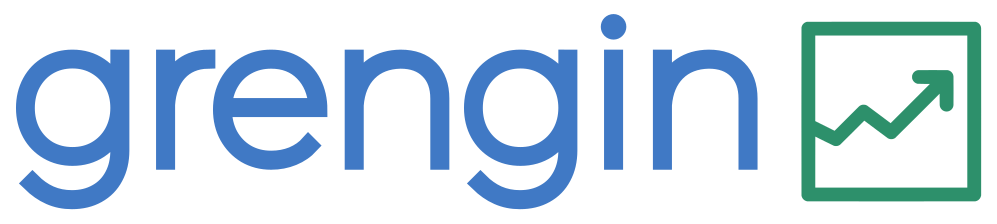

<p align="center">
  <a href="https://grengin.com" target="_blank">
    
  </a>
</p>

<p align="center">
  <a href="https://rustup.rs"></a>
  <!-- <a href="https://deps.rs/repo/github/grengin-oss/grengin-api/status.svg"></a> -->
  <a href="https://github.com/tokio-rs/axum"><a>
  <a href="https://www.postgresql.org"></a>
  <a href="https://swagger.io"></a>
  <a href="https://www.docker.com"></a>
  <a href="https://github.com/grengin-oss/grengin-api/blob/main/LICENSE.md"></a>
  <a href="https://github.com/grengin-oss/grengin-api/blob/main/LICENSE_FAQ.md"></a>
  <a href="https://github.com/grengin-oss/grengin-api/blob/main/LICENSE_ENTERPRISE.md"></a>
  <a href="https://github.com/grengin-oss/grengin-api/blob/main/CONTRIBUTOR_LICENSE.md"></a>
</p>

Grenging is an AI-native business growth engine. It simplifies a well-governed access to the most important AI tools, while collaborating with the other classic and AI tools to work as an assistant for all.

## License

This project uses a **dual-license model** designed to keep the software free for individuals, small businesses, and non-commercial use, while requiring larger commercial entities to obtain a paid license.

### Community Edition (Free)

**You can use Grengin for free if:**
- Your organization has less than **$5M USD** in annual revenue, OR
- You're using it for **non-commercial purposes** (personal, educational, research), OR
- You're using it for **internal tools** that don't directly generate revenue, OR
- You're an **individual**, **non-profit**, or **educational institution**

### Commercial License Required

**You need a commercial license if:**
- Your organization has **$5M+ annual revenue**, AND
- You're using Grengin for commercial purposes

📄 **[Read the full license](LICENSE.md)** | 💬 **[License FAQ](LICENSE_FAQ.md)** | 💼 **[Commercial licensing](LICENSE_ENTERPRISE.md)**

**Questions?** Contact licensing@grengin.com

---

## Contributing

We welcome contributions from the community! By contributing to Grengin, you agree to license your contributions under our dual-license model.

- **Small contributions** (bug fixes, typos, minor improvements) can be submitted directly via pull request
- **Significant contributions** (new features, major changes) require signing our [Contributor License Agreement](CONTRIBUTOR_LICENSE.md)

You retain full ownership of your contributions - the CLA simply grants us the rights to include them in both Community and Enterprise editions.

**[Read the full CLA](CONTRIBUTOR_LICENSE.md)**

---

## Configure Environment
```bash
  cp src/sample.env .env
```

## Database Migration
```bash
cargo install sea-orm-cli
sea-orm-cli migrate up
```

## Build
```bash
  export SWAGGER_UI_OVERWRITE_FOLDER="${PWD}/swagger-overrides" && cargo build --release
```
